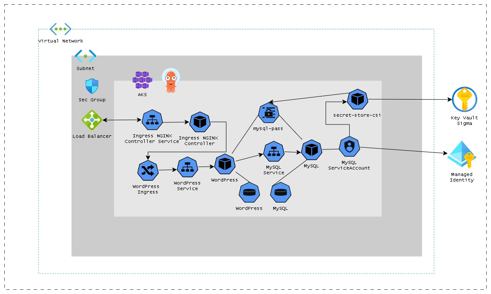

# Sigma DevOps Test
## Step-by-step plan

### 1. Create GitHub repository
Chose to do monorepo for the sake of simplicity.

Access the [project](https://github.com/orgs/sigma-devops-test/projects/1/views/1).

---

### 2. Install Docker Desktop

---
<details><summary>

### 3. Configure Environment
</summary>

3.1 Download and install Base Ubuntu (Windows CMD):
```cmd
set project=sigma
set project_path=%homepath%\.wsl
set os_version=22.04
mkdir %project_path%
curl -o %project_path%\ubuntu-%os_version%.tar.gz ^
  http://cdimage.ubuntu.com/ubuntu-base/releases/%os_version%/release/ubuntu-base-%os_version%-base-amd64.tar.gz
wsl --import %project% %project_path%\%project% %project_path%\ubuntu-%os_version%.tar.gz --version 2
wsl -d %project%
```

3.2 Configure WSL:
```bash
apt-get update && apt-get upgrade -y && apt-get install -y sudo curl git
groupadd admin
username=sigma
useradd -m -G admin docker -s /bin/bash $username
# No SystemD on base image.
tee -a /etc/wsl.conf <<EOT
[user]
default=$username
EOT
mkdir -p /home/${username}/.config/nvim
cat <<'EOF' > /home/${username}/.config/nvim/init.lua
vim.opt.number = true
vim.opt.relativenumber = true
vim.keymap.set("n", "<C-s>", ":w<CR>")
vim.keymap.set("i", "<C-s>", "<Esc>:w<CR>li")
vim.keymap.set("n", "<S-Q>", ":q<CR>")
EOF
passwd $username && exit
```

3.3:
```cmd
wsl --terminate %project%
wsl -d %project%
```

3.4 Set up environment for Docker (WSL):
```bash
cd
git clone https://github.com/sigma-devops-test/test.git
cd test
docker build -t sigma .
docker run \
  -v $(pwd):/home/sigma/test \
  -v ~/.ssh:/home/sigma/.ssh \
  -v ~/.azure:/home/sigma/.azure \
  -v ~/.kube:/home/sigma/.kube \
  -v ~/.config:/home/sigma/.config \
  -it --name sigma --rm -w /home/sigma/test sigma
```
</details>

---

### 4. Create Azure account

---

### 5. Study

#### 5.0 Basic Azure Concepts
What is:
  - [Tenant ID](https://learn.microsoft.com/en-us/entra/fundamentals/whatis): represents a Azure AD directory. The identity boundary for users, groups, and apps.
  - [Subscription ID](https://learn.microsoft.com/en-us/azure/cost-management-billing/manage/create-subscription): billing container for resources. All deployments are tied to one.
  - [Resource Group](https://learn.microsoft.com/en-us/azure/azure-resource-manager/management/manage-resource-groups-portal#what-is-a-resource-group): logical group for managing and organizing Azure resources.
  - [Azure Resource Providers](https://learn.microsoft.com/en-us/azure/azure-resource-manager/management/resource-providers-and-types): APIs that manage different types of resources (e.g., `Microsoft.KeyVault`, `Microsoft.Network`). The resource provider defines REST operations for managing vaults, secrets, keys, and certificates.


#### 5.1 Accounts, Authentication and Authorization
Learn the best and safest way to authenticate to Azure programatically so to run Terraform etc.

##### 5.1.1. Authentication
- **Service Principal (SP)**  
  - An identity for apps/scripts to log into Azure.
  - Requires:
    - `appId` (client ID)
    - `password` (client secret or certificate)
    - `tenant ID`
  - Used in CI/CD, Terraform, scripts, etc.

- **Managed Identity (MI)**
  - Automatically created and managed by Azure.
  - No secrets needed.
  - Two types:
    - **System-assigned**: Tied to a single resource.
    - **User-assigned**: Reusable across multiple resources.
  - Used by internal Azure services to access another Azure services securely.

- **Workload Identity Federation (OIDC)**
  - Used for **pods in AKS** to authenticate to Azure securely.
  - Uses OIDC tokens from Kubernetes to act as Azure identities.
  - Requires:
    - Azure AD App registration with federated credentials.
    - Matching **ServiceAccount** in K8s.

**Token Flow**
1. Service (SP, MI, or Pod with federated identity) requests token from Azure AD.
2. Azure AD authenticates the identity.
3. Azure AD issues a **JWT access token** for the resource (e.g., Key Vault).
4. Token is used in API calls.

##### 5.1.2. Authorization
**Key Concepts**
- **Role Definition**
  - A set of permissions (e.g., `read`, `write`, `delete`)
  - Examples:
    - `Reader`
    - `Contributor`
    - `Key Vault Secrets User` (read secrets only)
    - `Storage Blob Data Contributor`

- **Role Assignment**
  - Binds:
    - a **principal** (user, group, SP, or MI)
    - to a **role**
    - at a **scope** (subscription, resource group, or resource)

**Authorization Flow**
1. Authenticated entity gets an access token.
2. Tries to call an Azure resource (e.g., read from Key Vault).
3. Azure checks the token's **principal ID** against RBAC assignments.
4. If role matches the required permission at the resource scope, access is granted.

---

#### 5.1.3 Best Practices
- Use **Managed Identity** when possible — no secrets to rotate.
- Avoid assigning roles at **subscription** scope unless really needed.
- Use **least privilege**: only assign the permissions a service truly needs.
- For AKS pods, prefer **Workload Identity** over using secrets inside containers.

**References**
- [Azure Identity Overview](https://learn.microsoft.com/en-us/azure/active-directory/workload-identities/)
- [Azure RBAC Overview](https://learn.microsoft.com/en-us/azure/role-based-access-control/overview)
- [Service Principals](https://learn.microsoft.com/en-us/entra/identity-platform/app-objects-and-service-principals)
- [Managed Identity](https://learn.microsoft.com/en-us/azure/active-directory/managed-identities-azure-resources/overview)


##### 5.2.1 Create Service Princial for programmatic use in Terraform and Kubernetes
```bash
az login
export ARM_SUBSCRIPTION_ID="$(az account list --query "[0].id" -o tsv)"
cd terraform
az ad sp create-for-rbac --name "sigma-devops" --role "User Access Administrator" --scopes /subscriptions/$ARM_SUBSCRIPTION_ID > .azure
```
[Configuration](https://github.com/sigma-devops-test/test/blob/main/terraform/modules/azure/aks/main.tf#L57) to access the cluster as Administrator:
```hcl
data "azuread_service_principal" "main" {
  ...
}

resource "azuread_group" "main" {
  ...
}

resource "azuread_group_member" "main" {
  for_each         = data.azuread_service_principal.main
  group_object_id  = azuread_group.main.object_id
  member_object_id = data.azuread_service_principal.main[each.key].object_id
}

resource "azurerm_kubernetes_cluster" "main" {
  ...
  azure_active_directory_role_based_access_control {
    azure_rbac_enabled     = true
    admin_group_object_ids = [azuread_group.main.object_id]
  }
}
```

#### 5.2 Architecture: network and related project dependencies
Learn about Network Architecture and AKS Cluster dependencies (VPC, subnets, security rules, endpoints, etc).

[Azure Kubernetes Service (AKS) - Plan your design and operations](https://learn.microsoft.com/en-us/azure/architecture/reference-architectures/containers/aks-start-here)

[WordPress on Azure Kubernetes Service](https://learn.microsoft.com/en-us/azure/architecture/example-scenario/infrastructure/wordpress-container)

[Tutorial: Deploy WordPress app on AKS with Azure Database for MySQL - Flexible Server](https://learn.microsoft.com/en-us/azure/mysql/flexible-server/tutorial-deploy-wordpress-on-aks)

This is roughly the final architecture based on the node pool 'wordpress'.



---

### 6. AuthN and AuthZ inside AKS

#### 6.1. Authentication
- **User Authentication (kubectl, etc.)**
  - Uses Azure AD or kubeconfig to authenticate.
  - Usually done via `az login` + `az aks get-credentials`.
  - The kubeconfig holds:
    - Cluster endpoint
    - `client-certificate-data` or token
    - Azure CLI auth plugin reference (OIDC-based)

- **Service Account Tokens**
  - Pods use service accounts to interact with the Kubernetes API.
  - Each pod gets a JWT token mounted at `/var/run/secrets/kubernetes.io/serviceaccount/token`.
  - Token is signed by the **Kubernetes API Server**.

- **OIDC Identity Token**
  - When using **Azure Workload Identity**, service account tokens are OIDC-compliant.
  - Short-lived, signed tokens used for federated login to Azure AD.

#### 6.2. Pod Access to Azure Resources Best Practices
- **Using Managed Identity + Workload Identity**
  - Secure, passwordless, secretless.
  - Uses federated OIDC tokens + Azure AD.
  - Components:
    - **Service Account (SA)**  
      Pod uses this to get a signed token from Kubernetes.
    - **OIDC Issuer**  
        Kubernetes API Server has a public OIDC issuer URL, enabled by [this](https://github.com/sigma-devops-test/test/blob/main/terraform/modules/azure/aks/main.tf#L61) configuration:
        > `oidc_issuer_enabled = true`
    - **Azure AD App Registration**

        Links the OIDC identity with Azure. Automatically created when a User-Assigned Managed Identity (UAMI) is created. This app represents the identity in Azure AD that tokens will be validated against.
    - **Federated Identity Credential**  
        Connects:
        - OIDC Issuer
        - Kubernetes SA (`system:serviceaccount:<namespace>:<sa-name>`)
        - Azure User-Assigned Managed Identity
        - Supported by [this](https://github.com/sigma-devops-test/test/blob/main/terraform/modules/azure/aks/main.tf#L62) configuration:
        > `workload_identity_enabled = true`

#### 6.3. OIDC Federation Flow
1. Pod runs with a specific ServiceAccount.
2. Pod requests a token from the Kubernetes API (`aud: api://AzureADTokenExchange`).
3. Kubernetes issues a short-lived **OIDC JWT token** signed with its private key.
4. The pod sends this token to **Azure AD**.
5. Azure AD checks if:
   - Issuer matches the **AKS OIDC URL**
   - Subject matches a federated credential:
     > `system:serviceaccount:<namespace>:<serviceaccount>`
6. If matched, Azure AD returns an **access token for the Managed Identity**.
7. Pod uses that token to call Azure services (e.g., **Key Vault**, **Blob Storage**, etc).

#### 6.4. Best Practice Setup for Pods with Azure Access
1. Create a [**User-Assigned Managed Identity** (UAMI)](https://github.com/sigma-devops-test/test/blob/main/terraform/main.tf#L62-L67) in Azure.
2. Assign the UAMI with a [Role](https://github.com/sigma-devops-test/test/blob/main/terraform/main.tf#L77-L82).
3. Add a [**Federated Credential**](https://github.com/sigma-devops-test/test/blob/main/terraform/main.tf#L84-L93):
   - Issuer = AKS OIDC issuer
   - Subject = `system:serviceaccount:<namespace>:<serviceaccount>`
4. In Kubernetes:
   - Create a [ServiceAccount](https://github.com/sigma-devops-test/test/blob/main/kubernetes/helm/charts/wordpress/values.yaml#L22-L26) with annotation:
     ```yaml
     annotations:
       azure.workload.identity/client-id: "<uami-client-id>"
     ```
5. Deploy [pod using that ServiceAccount](https://github.com/sigma-devops-test/test/blob/main/kubernetes/helm/charts/wordpress/templates/mysql-deployment.yaml#L28).
6. Pod now receives a token to exchange for Azure access.

**References**
- [Azure Workload Identity (official)](https://learn.microsoft.com/en-us/azure/aks/workload-identity-overview)
- [Kubernetes AuthN & AuthZ](https://kubernetes.io/docs/reference/access-authn-authz/)
- [Use Workload Identity with Azure Key Vault](https://learn.microsoft.com/en-us/azure/aks/csi-secrets-store-identity-access)
